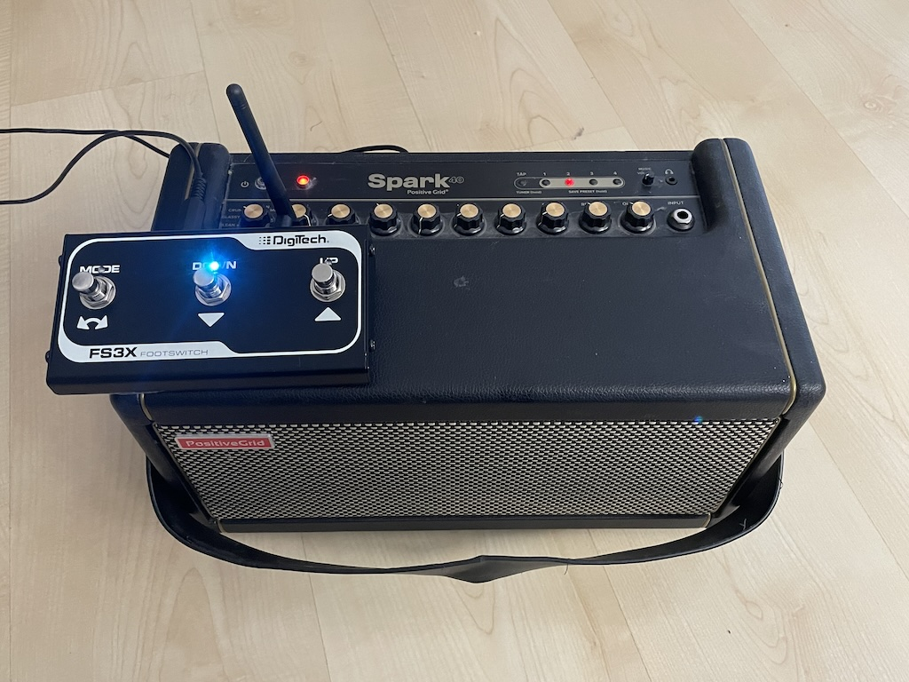
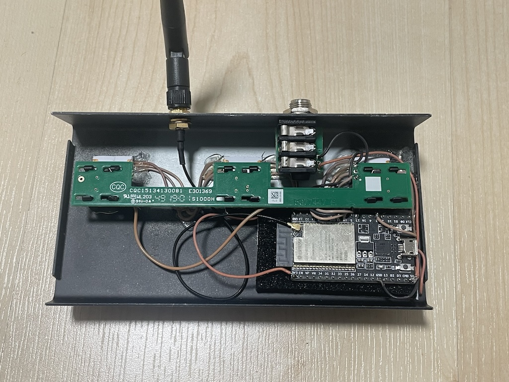

# Minimal Foot Pedal for Spark 40

When I needed a footswitch, it was unclear if it was possible to order [Positive Grid's Spark Control](https://www.positivegrid.com/products/spark-control) here.
Instead, I wondered how hard could it be since there's an iOS app to control it and it's using BLE. Before trying to reverse engineer the protocol, a short Internet search revealed that others had already done that. Now, only a suitable mechanical pedal with at least 3 buttons was needed and found in the DigiTech FS3X. When the hardware was finally ready, I realized that I could have ordered the original Spark Control in the end and saved me some fun time - but who would do that?

## Overview 

This project implements a version of a preset switcher for Positive Grid's Spark 40 amplifier
using the [BlueKitchen's BTstack](https://github.com/bluekitchen/btstack) for the Bluetooth communication.

It is intened to be integrated into a basic mechanical foot pedal with up to 4 momentary switches and uses an ESP32 or one it's variants. 

The current version is configured for an ESP32 with a [DigiTech FS3X 3-Button Footswitch](https://www.digitech.com/foot-controllers/FS3X+3-Button+Footswitch.html). The three buttons are mapped to presets 0-2. Unmodified, the FS3X has a 3-pin 6.5mm headphone connector with one GND and two signal lines. The MODE button connects the first line to GND. The DOWN button connects the second line to GND. The UP button connects both signal lines to GNF with 2 diode. To simplify the logic, the diodes
have been removed and the buttons have been connected directly to GPIO pins of the ESP32.

3 WS2812b ("NeoPixel") LEDs are used to indicate the current preset and the connection state.

## Hardware

The three buttons are connected to three GPIOs and the three WS23812b LEDs are connected to GPIO. The existing 6.5mm was used to power the ESP32 from a regular USB-A power supply.

GPIO | Function  | Notes
-----|-----------|------
0    | LED strip | 3 x WS2812b
18   | Button A  | "MODE"
19   | Button B  | "DOWN"
21   | Button C  | "UP" 

 
## Credits

The Bluetotoh GATT implementation is based on [Yury Tsybizov's BLE Message documentation](https://github.com/jrnelson90/tinderboxpedal/blob/master/src/BLE%20message%20format.md).
